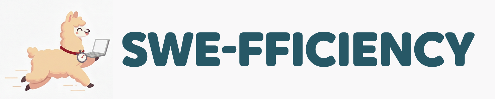
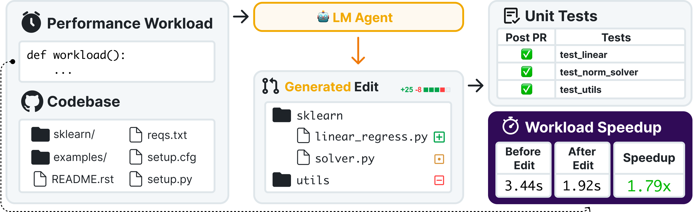
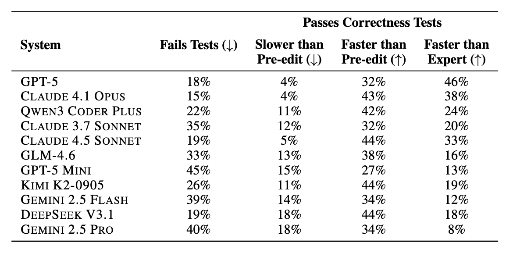
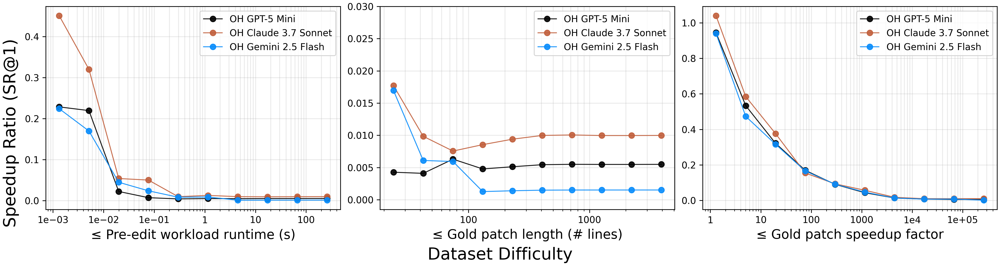
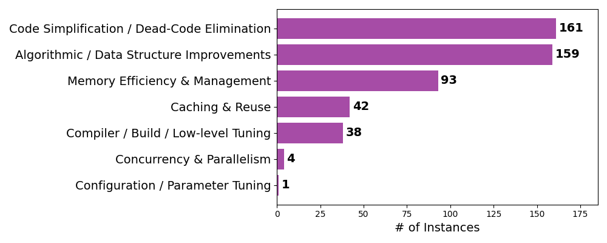
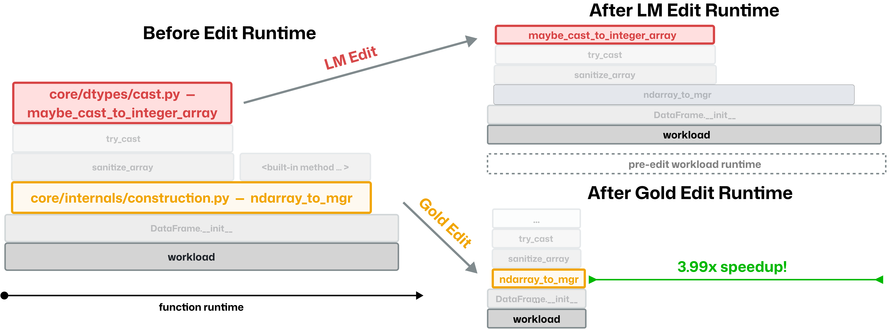
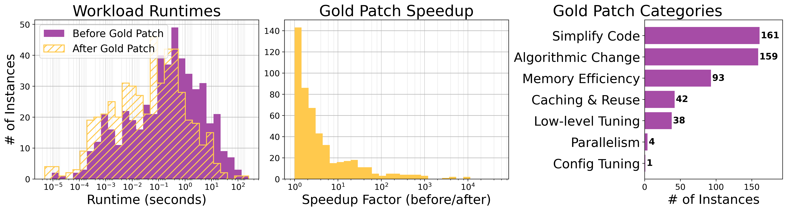

<div align="center">
  
</div>

<p align="center">
  <a href="https://github.com/Ethara-Ai/kraken">
    
  </a>
  <a href="https://huggingface.co/datasets/ethara/Kraken">
    
  </a>
  <a href="https://arxiv.org/abs/2511.06090">
    
  </a>
  
  
  
  <a href="LICENSE">
    
  </a>
</p>

---

# Kraken: Benchmarking LLM Coding Agents on Real-World Performance Optimization

**TL;DR** — Kraken is a *repository-level* evaluation framework for **performance optimization** (not bug fixing). It builds on the SWE-fficiency methodology to jointly evaluate LLM agents on correctness and runtime efficiency. Each task ships:
- a full codebase snapshot,
- a targeted **performance workload** to speed up,
- and the subset of repository **correctness tests** that must remain green.

We evaluate patches by applying them, running the correctness suite, and measuring runtime speedups against the *expert (human) PR* using the **Harmonic Speedup Ratio (HSR)**.

---

## 🚀 What is Kraken?

Kraken evaluates *pass-to-pass* performance engineering: start from a codebase and a slow workload, improve runtime, and **don't break behavior**. The focus is on **investigation** (profiling/localization) and **correctness-preserving** edits—mirroring how performance engineers work day-to-day.

Unlike traditional SWE benchmarks that measure only functional correctness, Kraken jointly evaluates **correctness and efficiency**. Agents must produce patches that pass the test suite *and* deliver measurable speedups.

### Highlights
- **Performance-Aware Evaluation**: Jointly measures functional correctness *and* runtime speedup. A patch that breaks tests scores zero, even if it's fast.
- **Real repos, real workloads**: **20** tasks from **6** major Python libraries—**networkx, flask, fastapi, pydantic, httpx, jinja**.
- **Docker-Isolated Runs**: Every evaluation runs in a prebuilt container matched to the target repository's environment with CPU/memory pinning, ensuring reproducibility.
- **Flexible Agent Integration**: Works with OpenHands, SWE-agent, Cursor CLI, or any agent that produces git patches.
- **Full Pipeline Automation**: The `run_pipeline.sh` orchestrator handles everything from GitHub PR scraping through to evaluation reports.
- **Rich Analysis Toolkit**: Scripts for flamegraph profiling, workload distribution analysis, difficulty classification, and model comparison plots.

### Why This Matters

Performance improvements in widely used libraries have outsized impact. Kraken isolates the open-ended challenge: **find bottlenecks, propose safe optimizations, and prove correctness** against the repository's own tests—at repository scope.

---

## 📦 Install & Environment

We recommend Python 3.12 and a Linux host. The benchmark is also installable via `pip` in editable mode.

```bash
uv venv --python 3.12
source .venv/bin/activate
uv sync

# Alternatively, you can install directly via pip.
pip install -e .
```

## Quick Start

Evaluating on Kraken is a multi-step process via our package's CLI.

### Step 0: VM / Container Setup (highly recommended for reproducibility)

For faithful reproduction of results, use a large VM (we recommend GCP `n2-standard-64`) and run the setup scripts to configure Docker and CPU pinning. We recommend using `--num_workers 12` on this configuration, which allocates 4 vCPUs and 16 GB RAM per worker.

```bash
bash scripts/vm/setup_vm.sh

# IMPORTANT: This script pins the number of CPUs for the docker daemon
# hence why it must be run in sudo privileges. This is so image building
# and pulling overhead does not interfere with evaluation.
sudo scripts/vm/setup_docker.sh MEM_MAX MEM_HIGH
```

### Step 1: Run gold baseline (establishes reference performance)

```bash
swefficiency eval --run_id my_eval --num_workers 12
```

This runs the expert (human) patches to establish baseline performance metrics. Results are stored in `logs/run_evaluation/my_eval/gold/`.

### Step 2: Run your model predictions

```bash
swefficiency eval --run_id my_eval --num_workers 12 --prediction_path predictions.jsonl
```

Your predictions file should be JSONL with each line containing:
```json
{"instance_id": "<id>", "model_patch": "<patch_text>", "model_name_or_path": "<model_name>"}
```

Results are stored in `logs/run_evaluation/my_eval/<model_name>/`.

### Step 3: Generate evaluation report

```bash
swefficiency report \
    --gold_run logs/run_evaluation/my_eval/gold \
    --pred_run logs/run_evaluation/my_eval/<model_name>
```

This generates two output files in `eval_reports/`:
- `eval_report_<model_name>.csv` — Per-instance results
- `eval_report_<model_name>.json` — Summary metrics including:
  - `overall_score`: Harmonic mean of HSR across instances
  - `proportion_incorrect`: Instances that failed correctness tests
  - `proportion_correct_but_no_speedup`: Correct but slower than baseline
  - `proportion_human_speedup_or_better`: Matched or beat expert performance

---

## 🧰 Dataset

The Kraken benchmark dataset is available on **[Hugging Face](https://huggingface.co/datasets/ethara/Kraken)**.

### Statistics

| Property | Value |
| :--- | :--- |
| Total Instances | 20 |
| Source Repositories | 6 |
| Gold Speedup Range | 1.02× &ndash; 26.92× |
| Mean Gold Speedup | 4.22× |
| Median Gold Speedup | 1.49× |
| Primary Metric | Harmonic Speedup Ratio (HSR) |

### Repository Coverage

| Repository | Instances | Domain | Speedup Range |
| :--- | :---: | :--- | :---: |
| `networkx/networkx` | 10 | Graph algorithms | 1.02× &ndash; 13.09× |
| `pallets/flask` | 4 | Web framework | 1.10× &ndash; 2.50× |
| `fastapi/fastapi` | 2 | Async web framework | 1.61× &ndash; 9.36× |
| `pydantic/pydantic` | 2 | Data validation | 1.67× &ndash; 6.51× |
| `encode/httpx` | 1 | HTTP client | 26.92× |
| `pallets/jinja` | 1 | Template engine | 1.25× |

### Difficulty Distribution

| Difficulty | Count | Description |
| :--- | :---: | :--- |
| Easy | 4 | Straightforward optimizations (e.g., using built-in functions) |
| Medium | 5 | Moderate algorithmic improvements |
| Hard | 9 | Complex multi-file changes requiring deep framework knowledge |
| Expert | 2 | Architectural-level optimizations spanning multiple components |

### Task Structure (per instance)

Each task in the dataset includes:
- Repo snapshot + diff metadata
- A **performance workload** script that exhibits a measurable speedup under the expert patch
- The set of repository **tests** whose coverage intersects the expert diff (the "guarding" tests)

> The workloads are **separate from correctness tests** (as in real projects). The benchmark rejects instances whose speedups are not statistically significant in a controlled environment.

---

## 📊 Evaluation

### Metric: Harmonic Speedup Ratio (HSR)

The **Harmonic Speedup Ratio (HSR)** is the primary aggregate metric. For each instance:

1. **Apply** the candidate patch to the codebase at `base_commit`
2. **Test** — run the `FAIL_TO_PASS` + `PASS_TO_PASS` test suites
3. **Benchmark** — measure runtime of original vs. patched code under the declared workload
4. **Score** — derive `correctness` (binary pass/fail), `speedup` (runtime ratio), and `HSR` (harmonic mean of both)

If a patch fails to apply or breaks correctness tests, it scores zero for that instance.

### Baseline Results

Two models evaluated on Kraken using this harness:

| Model | Correctness | HSR (Harmonic) | Mean HSR | Mean LM Speedup |
| :--- | :---: | :---: | :---: | :---: |
| GLM-5 | 14 / 20 (70%) | 0.313 | 0.984 | 2.84× |
| Kimi K2.5 | 12 / 20 (60%) | 0.268 | 0.606 | 1.62× |

### Performance Visualizations

<table align="center" width="100%">
  <tr>
    <td align="center" width="50%" valign="top">
      <a href="docs/assets/figures/swefficiency_overview.png">
        
      </a>
      <br/>
      <b>Figure 1.</b> Benchmark overview — HSR, correctness, and speedup across models.
    </td>
    <td align="center" width="50%" valign="top">
      <a href="docs/assets/figures/correctness_breakdown.png">
        
      </a>
      <br/>
      <b>Figure 2.</b> Correctness breakdown by difficulty tier.
    </td>
  </tr>
  <tr>
    <td align="center" width="50%" valign="top">
      <a href="docs/assets/figures/scaling_trends.png">
        
      </a>
      <br/>
      <b>Figure 3.</b> Scaling trends — model performance vs. compute budget.
    </td>
    <td align="center" width="50%" valign="top">
      <a href="docs/assets/figures/diff_classification_counts.png">
        
      </a>
      <br/>
      <b>Figure 4.</b> Diff classification — types of changes agents make.
    </td>
  </tr>
  <tr>
    <td align="center" width="50%" valign="top">
      <a href="docs/assets/figures/flamegraph.png">
        
      </a>
      <br/>
      <b>Figure 5.</b> Flamegraph analysis — profiling agent vs. gold patch runtime.
    </td>
    <td align="center" width="50%" valign="top">
      <a href="docs/assets/figures/workload_distribution.png">
        
      </a>
      <br/>
      <b>Figure 6.</b> Workload distribution across repositories.
    </td>
  </tr>
</table>

---

## 🛠️ Generation (Agents & Harness)

We provide integration points for popular SWE agent harnesses like OpenHands and SWE-agent via prebuilt Docker containers.

We ship **prebuilt Docker images** for generation to match the evaluation environment and avoid dependency drift.

> Recommended per-task limits: **3 hours** wall-clock, **100** max actions/turns; be generous with workload timeouts (since tests or workloads can be substantial).

Need a generalized way to prep instances, run your agent, and capture patches? See
`scripts/inference/README.md` for the inference harness. It loads the
dataset directly from Hugging Face, runs prework/inference steps
defined in YAML specs (Cursor CLI example included), and writes git patches ready
for evaluation via `swefficiency eval`.

### OpenHands

```bash
python scripts/inference/custom.py \
  --run-id openhands_run \
  --spec scripts/inference/specs/openhands_agent.yaml \
  --num-workers 4 \
  --max-instances 10
```

### Cursor CLI

```bash
python scripts/inference/custom.py \
  --run-id cursor_run \
  --spec scripts/inference/specs/cursor_cli.yaml \
  --num-workers 4 \
  --var cursor_cli_args="--max-steps 75"
```

---

## 🔬 Reproducibility Tips

* Use the provided **container images** (prebuilt for each instance).
* **Pin CPU and memory** per worker (4 vCPUs / 16 GB RAM). See `scripts/vm/` for details.
* Pre-built images include everything needed.
* Run gold baselines first before comparing model predictions.

---

## 📈 Baseline Snapshot

Overall, agents today are **far from expert parity** (HSR ≪ 1.0) and frequently introduce correctness regressions when attempting optimizations. Both models achieve perfect correctness on Easy instances but struggle significantly with Hard problems, where deep framework knowledge and multi-step reasoning are decisive.

| Difficulty | GLM-5 | Kimi K2.5 |
| :--- | :---: | :---: |
| Easy | 4 / 4 (100%) | 4 / 4 (100%) |
| Medium | 4 / 5 (80%) | 4 / 5 (80%) |
| Hard | 5 / 9 (56%) | 3 / 9 (33%) |
| Expert | 1 / 2 (50%) | 1 / 2 (50%) |

---

## 🧭 Project Structure (high level)

```
.
├── scripts/
│   ├── eval/           # evaluation runner + aggregator
│   ├── inference/      # agent inference harness
│   ├── perf/           # performance analysis scripts
│   ├── annotate/       # dataset annotation tools
│   └── vm/             # docker & VM pinning helpers
├── swefficiency/       # python package (cli, utils, loaders)
│   ├── cli.py          # CLI entrypoint (eval/report commands)
│   ├── harness/        # evaluation harness (Docker, grading)
│   ├── collect/        # dataset collection pipeline
│   ├── versioning/     # python version detection
│   ├── perf_filter/    # performance PR filtering
│   └── workload/       # synthetic workload generation
├── analysis/           # research & analysis scripts
├── tests/              # test suite
├── docs/assets/figures # charts & visualization images
└── README.md
```

---

## Acknowledgements

This codebase began as a fork from SWE-Gym's fork of SWE-Bench (https://github.com/SWE-Gym/SWE-Bench-Fork). We updated repo specific dependencies in the constants files, extended the data pipeline to be able to filter performance specific commits (as per our paper), and updated the evaluation harness to validate our performance + correctness setting. We've also added several helper scripts and utilities to support evaluation and experiment analysis.

### Methodology

Kraken builds on the **SWE-fficiency** methodology, which extends SWE-Bench with performance workloads and defines the Harmonic Speedup Ratio (HSR) metric:

> Ma et al., *"SWE-fficiency: Can Language Models Optimize Real-World Repositories on Real Workloads?"*, arXiv:2511.06090, 2025.

## License

Copyright 2026 Google LLC

All software is licensed under the Apache License, Version 2.0 (Apache 2.0); you may not use this file except in compliance with the Apache 2.0 license. You may obtain a copy of the Apache 2.0 license at: https://www.apache.org/licenses/LICENSE-2.0

All other materials are licensed under the Creative Commons Attribution 4.0 International License (CC-BY). You may obtain a copy of the CC-BY license at: https://creativecommons.org/licenses/by/4.0/legalcode

Unless required by applicable law or agreed to in writing, all software and materials distributed here under the Apache 2.0 or CC-BY licenses are distributed on an "AS IS" BASIS, WITHOUT WARRANTIES OR CONDITIONS OF ANY KIND, either express or implied. See the licenses for the specific language governing permissions and limitations under those licenses.

This is not an officially supported Google product. This project is not
eligible for the [Google Open Source Software Vulnerability Rewards
Program](https://bughunters.google.com/open-source-security).

---

<div align="center">
  <sub>Kraken Evaluation Framework — Benchmarking LLM Agents on Real-World Performance Optimization</sub>
</div>
